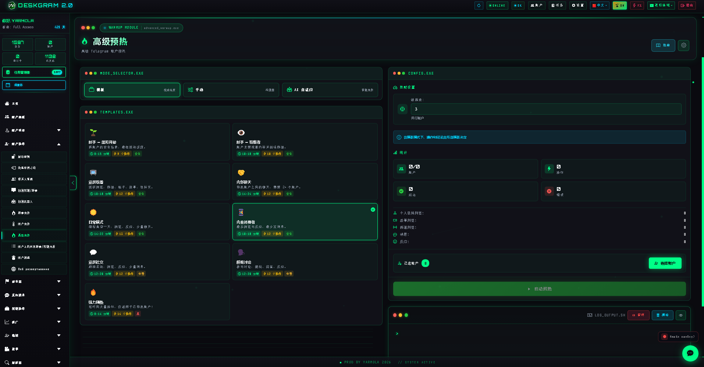
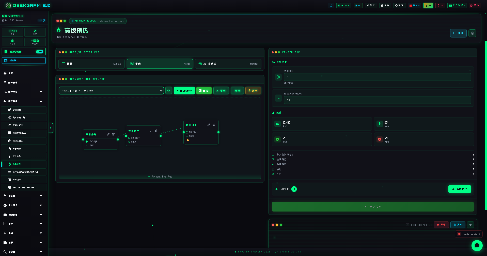
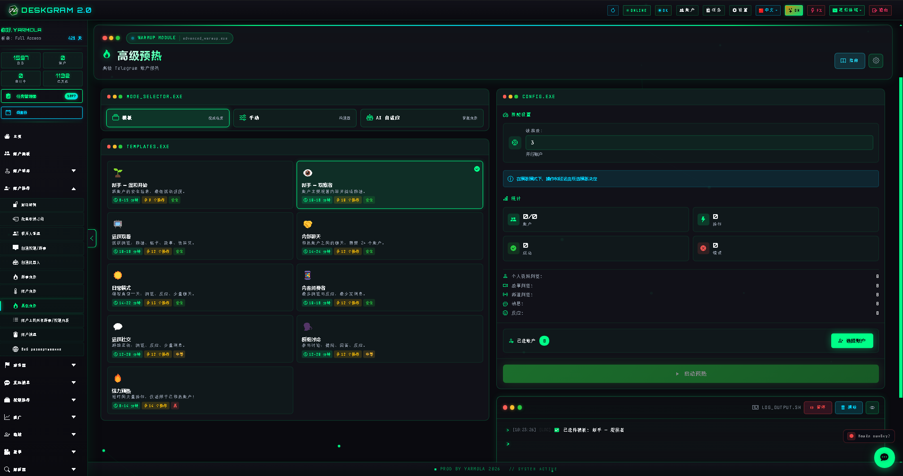
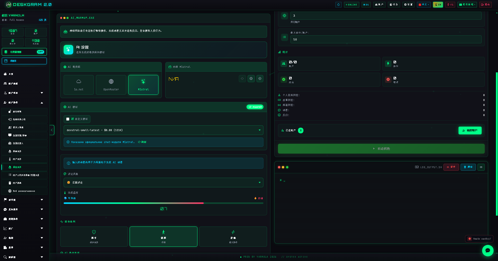

# Deskgram 2 高级 Telegram 预热

Deskgram 2 的高级预热模块不是单一固定流程，而是通过模板模式、手动 сценарий 组装和 AI 自适应行为来准备 Telegram 账号。这个模块适合在基础预热已经不够、账号网格需要更灵活准备路线时使用。

[Deskgram 2 Hub](https://github.com/Deskgram-2/deskgram-2-telegram-automation-zh) · [Website](https://deskgram2.com/) · [Telegram Bot](https://t.me/DG2welcomebot) · [Web Preview](https://deskgram2.com/web-preview?path=%2Fapp-demo%2F&lang=cn)

## 交互式 Web Preview

浏览器中查看模块界面：[打开 web preview](https://deskgram2.com/web-preview?path=%2Fapp-demo%2Ffunctions%2Fadvanced_warmup&lang=cn)

这样可以在真正启动账号准备流程之前先查看预热模式、模板和 AI 选项。

## Screenshots

## 模块概览

| 参数 | 内容 |
|---|---|
| 核心任务 | 为不同执行场景准备 Telegram 账号 |
| 关键模块 | 工作模式、模板、手动配置、AI 自适应 |
| 适用场景 | 在外联、增长、AI 活动前准备账号池 |
| 相关模块 | 账号管理、代理、设置、任务面板 |

## 模块能力

- 运行预设预热 сценарий；
- 为特定账号网格组装手动路线；
- 使用 AI 自适应行为降低流程僵硬度；
- 控制活跃级别和限制；
- 为下游模块准备更稳定的账号基础。

## 快速开始

1. 选择工作模式：模板、手动或 AI 自适应。
2. 根据你的账号网格目标配置预热 сценарий。
3. 设置活跃级别和限制。
4. 选择账号并启动流程。
5. 将已准备好的账号转入下一个执行模块。

## 适合与哪些模块联动

- [账号管理](https://github.com/Deskgram-2/telegram-account-manager-deskgram-zh)
- [代理管理](https://github.com/Deskgram-2/telegram-proxy-manager-deskgram-zh)
- [系统设置](https://github.com/Deskgram-2/telegram-automation-settings-deskgram-zh)
- [任务管理](https://github.com/Deskgram-2/telegram-task-manager-deskgram-zh)
- [私信群发](https://github.com/Deskgram-2/telegram-direct-messaging-deskgram-zh)

## FAQ

### 可以先在浏览器里看模块吗？

可以，上面的 web preview 链接已经支持直接预览。

### 这个模块只适合 AI 场景吗？

不是。AI 只是其中一个模式，模板和手动路线同样可以单独使用。
